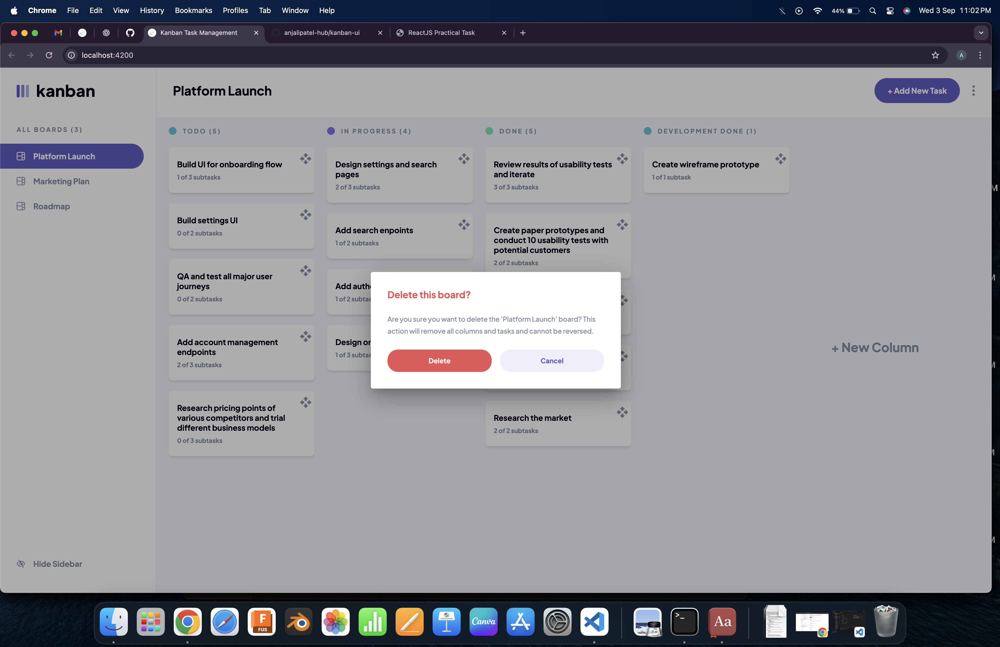

# Kanban Task Management Web App 🚀

Welcome to our Kanban Task Management web app, a powerhouse built with Angular version 17.0.5 and styled with the magic of Tailwind CSS. 🎨 This app is your ticket to organizing tasks with flair!

## Features 🌟

### Responsive Design 📱

Experience the optimal layout on any device - big or small. Our app is your companion, delivering a seamless experience wherever you go.

### CRUD Operations 🛠️

Effortlessly manage tasks:

- **Create**: Spawn new boards and tasks like a wizard.
- **Read**: Peek at your boards, tasks, and subtasks in one swift glance.
- **Update**: Edit on the fly, no strings attached.
- **Delete**: Bid farewell to boards and tasks that have overstayed their welcome.

### Form Validations 🚦

Instant feedback! Form validations ensure your creations are error-proof, making the experience smoother than butter.

### Subtask Management 🧩

Mark subtasks as complete and juggle tasks between columns like a pro. Stay organized and keep that productivity flowing.

### Board Sidebar 📁

Customize your space! Hide or show the board sidebar with a flick. One click, and you're in charge.

### Drag and Drop 🚚

Level up! Drag and drop tasks like a gaming pro. Change status, reorder - it's your canvas, paint it your way.

## Local Storage Integration 📦

Easily persist your Kanban board data locally using the power of `localStorage`. Never lose your work, even if you accidentally close the browser or refresh the page!

✨ Seamless Integration: Your board data is automatically saved to local storage in real-time as you make changes.

🔄 Auto-sync: Changes made on the board are automatically synchronized with local storage, ensuring your data is always up to date.

🚀 Fast Retrieval: Retrieve your board data instantly upon returning to the app, providing a smooth and efficient user experience.

## Getting Started 🚀

1. **Clone the Repository:**

   ```bash
   git clone https://github.com/anjalipatel-hub/kanban-ui.git
   ```

2. **Install Dependencies:**

   ```bash
   cd ng-kanban
   npm install
   ```

3. **Run the App:**

   Run `ng serve` or `npm start` for a dev server. Navigate to `http://localhost:4200/`. The application will automatically reload if you change any of the source files.
 

3. **UI Snapshots**

**Login**


**Sign-up**


**Kanban dashbpoard**


**Add/edit Task**


**Edit Board**


**Delet Board**


